<h2>Tensorflow-Image-Segmentation-Pancreas (2024/02/14)</h2>

This is the second experimental Image Segmentation project for Pancreas based on
the <a href="https://github.com/sarah-antillia/Tensorflow-Image-Segmentation-API">Tensorflow-Image-Segmentation-API</a>, and 
<a href="https://drive.google.com/file/d/141HL4nRT8LZoqtxk2un6cM-LDuZa7jtO/view?usp=sharing"> Cropped-Pancreas-ImageMask-Dataset</a>
 
 
In order to improve segmentation accuracy, we will use an online dataset augmentation strategy based on Python script <a href="./src/ImageMaskAugmentor.py">
ImageMaskAugmentor.py</a> to train a Pancreas Segmentation Model. 

 
As a first trial, we use the simple UNet Model 
<a href="./src/TensorflowUNet.py">TensorflowSlightlyFlexibleUNet</a> for this Pancreas Segmentation. 
As shown in <a href="https://github.com/sarah-antillia/Tensorflow-Image-Segmentation-API">Tensorflow-Image-Segmentation-API</a>.
you may try other Tensorflow UNet Models: 

<li><a href="./src/TensorflowSwinUNet.py">TensorflowSwinUNet.py</a></li>
<li><a href="./src/TensorflowMultiResUNet.py">TensorflowMultiResUNet.py</a></li>
<li><a href="./src/TensorflowAttentionUNet.py">TensorflowAttentionUNet.py</a></li>
<li><a href="./src/TensorflowEfficientUNet.py">TensorflowEfficientUNet.py</a></li>
<li><a href="./src/TensorflowUNet3Plus.py">TensorflowUNet3Plus.py</a></li>
 

<h3>1. Dataset Citation</h3>

The original image dataset used here has been taken from the following kaggle.com web site. 
<a href="https://www.kaggle.com/datasets/salihayesilyurt/pancreas-ct">
Pancreas-CT</a> 
Created by Sean Berryman, last modified by Tracy Nolan on Sep 16, 2020 
 
<b>About Dataset</b> 
Summary: 
<pre>
The National Institutes of Health Clinical Center performed 82 abdominal contrast enhanced 3D CT 
scans (~70 seconds after intravenous contrast injection in portal-venous) from 53 male and 27 
female subjects. Seventeen of the subjects are healthy kidney donors scanned prior to nephrectomy. 
The remaining 65 PANCREAS_s were selected by a radiologist from PANCREAS_s who neither had major 
abdominal pathologies nor pancreatic cancer lesions. Subjects' ages range from 18 to 76 years with 
a mean age of 46.8 ± 16.7. The CT scans have resolutions of 512x512 pixels with varying pixel sizes 
and slice thickness between 1.5 − 2.5 mm, acquired on Philips and Siemens MDCT scanners 
(120 kVp tube voltage).

A medical student manually performed slice-by-slice segmentations of the pancreas as ground-truth 
and these were verified/modified by an experienced radiologist.
</pre>
Reference: https://wiki.cancerimagingarchive.net/display/Public/Pancreas-CT 

<a href="./projects/TensorflowSlightlyFlexibleUNet/Augmented-Pancreas/LICENSE">LICENSE</a>

 

<h3>
<a id="2">
2 Pancreas ImageMask Dataset
</a>
</h3>
 If you would like to train this Pancreas Segmentation model by yourself,
 please download the dataset from the google drive 
<a href="https://drive.google.com/file/d/141HL4nRT8LZoqtxk2un6cM-LDuZa7jtO/view?usp=sharing">
Cropped-Pancreas-ImageMask-Dataset.zip</a>  
 
Please see also the <a href="https://github.com/atlan-antillia/Pancreas-ImageMask-Dataset">Pancreas-ImageMask-Dataset</a>. 
Please expand the downloaded ImageMaskDataset and place them under <b>./dataset</b> folder to be

<pre>
./dataset
└─Cropped-Pancreas
    ├─test
    │  ├─images
    │  └─masks
    ├─train
    │  ├─images
    │  └─masks
    └─valid
        ├─images
        └─masks
</pre>
 
<b>Cropped-Pancreas Dataset Statistics</b> 
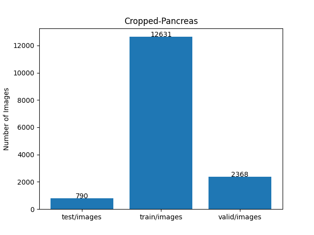 
As mentioned in <a href="https://github.com/atlan-antillia/Pancreas-ImageMask-Dataset">Pancreas-ImageMask-Dataset</a>, 
by applying two types of center cropping operations to the original images and masks files, the number of those files in this dataset has increased 
three-fold from the previous Non-Cropped Pancreas dataset.
However, simply increasing the number of image and mask files does not necessarily lead to direct improvement in the segmentation accuracy.

 

<h3>
<a id="3">
3 TensorflowSlightlyFlexibleUNet
</a>
</h3>
This <a href="./src/TensorflowUNet.py">TensorflowUNet</a> model is slightly flexibly customizable by a configuration file. 
For example, <b>TensorflowSlightlyFlexibleUNet-Augmented-Pancreas</b> model can be customizable
by using the following <a href="./projects/TensorflowSlightlyFlexibleUNet/Augmented-Pancreas/train_eval_infer.config">
train_eval_infer.config file.</a>
<pre>
; train_eval_infer.config
; Pancreas, GENERATOR_MODE=True
; 2024/02/12 (C) antillia.com
[model]
generator     = True
image_width    = 512
image_height   = 512
image_channels = 3
num_classes    = 1
base_filters   = 16
base_kernels   = (5,5)
num_layers     = 7
dropout_rate   = 0.08
learning_rate  = 0.0001

clipvalue      = 0.5
dilation       = (2,2)
;loss           = "binary_crossentropy"
loss           = "bce_iou_loss"
;metrics        = ["iou_coef"]
;metrics        = ["binary_accuracy", "sensitivity", "specificity"]
metrics        = ["binary_accuracy"]
show_summary   = False

[train]
epochs        = 100
batch_size    = 4
steps_per_epoch  = 200
validation_steps = 100
patience      = 10
;metrics       = ["iou_coef", "val_iou_coef"]
metrics       = ["binary_accuracy", "val_binary_accuracy"]

model_dir     = "./models"
eval_dir      = "./eval"

image_datapath = "../../../dataset/Cropped-Pancreas/train/images/"
mask_datapath  = "../../../dataset/Cropped-Pancreas/train/masks/"
create_backup  = False
learning_rate_reducer = False
save_weights_only = True

[eval]
image_datapath = "../../../dataset/Cropped-Pancreas/valid/images/"
mask_datapath  = "../../../dataset/Cropped-Pancreas/valid/masks/"

[test] 
image_datapath = "../../../dataset/Cropped-Pancreas/test/images/"
mask_datapath  = "../../../dataset/Cropped-Pancreas/test/masks/"

[infer] 
images_dir    = "../../../dataset/Cropped-Pancreas/test/images/"
output_dir    = "./test_output"
merged_dir    = "./test_output_merged"

[mask]
blur      = True
blur_size = (5,5)
binarize  = True
#threshold = 128
threshold = 74

[generator]
debug     = True
augmentation   = True

[augmentor]
vflip    = False
hflip    = False
rotation = True
angles   = [5, 10,]
#shrinks  = [0.8]
shears   = [0.2]
transformer = True
alpah       = 1300
sigmoid     = 8
</pre>
Please note that 
<a href="./src/ImageMaskAugmentor.py">
ImageMaskAugmentor.py</a> reads the parameters in [generator] and [augmentor] sections, and yields some images and mask to be used for the training and evaluation process of the UNet Model. 
<pre>
[augmentor]
vflip    = False
hflip    = False
rotation = True
angles   = [5, 10,]
#shrinks  = [0.8]
shears   = [0.2]
transformer = True
alpah       = 1300
sigmoid     = 8
</pre>
Depending on those parameters, it will generate rotated, 
sheared, elastic-transformed images and masks
from the original images and masks in the folders specified by image_datapath and mask_datapath in 
[train] and [eval] sections. 
<pre>
[train]
image_datapath = "../../../dataset/Cropped-Pancreas/train/images/"
mask_datapath  = "../../../dataset/Cropped-Pancreas/train/masks/"
[eval]
image_datapath = "../../../dataset/Cropped-Pancreas/valid/images/"
mask_datapath  = "../../../dataset/Cropped-Pancreas/valid/masks/"
</pre>

For more detail on ImageMaskAugmentor.py, please refer to
<a href="https://github.com/sarah-antillia/Image-Segmentation-ImageMaskDataGenerator">Image-Segmentation-ImageMaskDataGenerator </a>.
    
<h3>
3.1 Training
</h3>
Please move to a <b>./projects/TensorflowSlightlyFlexibleUNet/Augmented-Pancreas</b> directory, 
and run the following bat file to train TensorflowUNet model for Pancreas. 
<pre>
./1.train_by_generator.bat
</pre>
, which simply runs <a href="./src/TensorflowUNetGeneratorTrainer.py">TensorflowUNetGeneratorTrainer.py </a>
in the following way.
<pre>
python ../../../src/TensorflowUNetGeneratorTrainer.py ./train_eval_infer.config
</pre>
Train console output: 
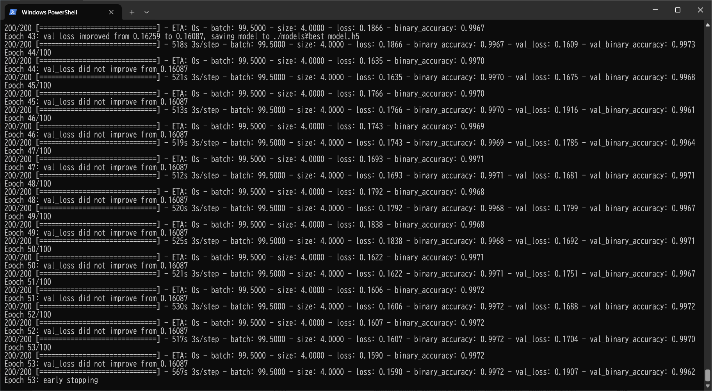 

As shown above, at epoch 43, the val_loss became 0.1609, which is slightly better (lower) than that value 0.2259 of 
the console output of the first experiment. 
 
Train console output of the first experiment: 
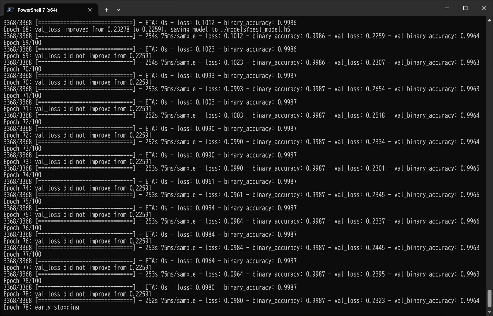

 
Train metrics: 
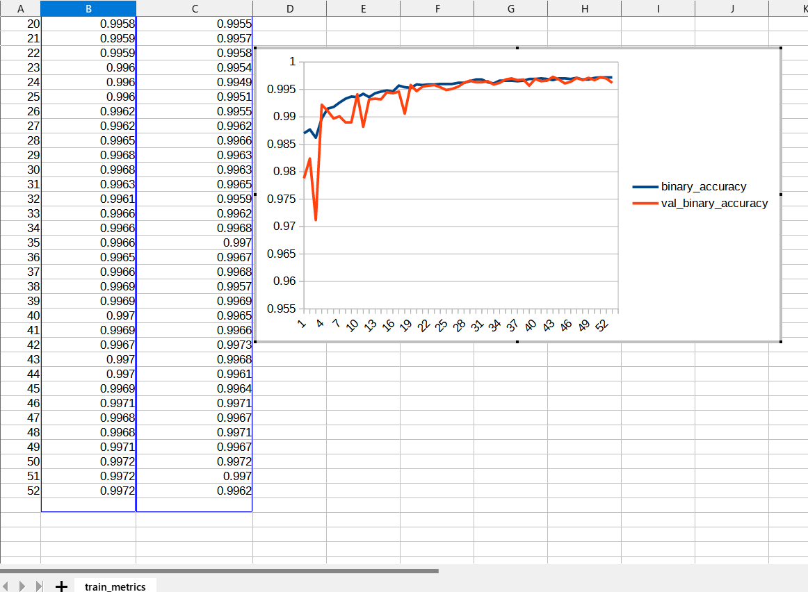 
Train losses: 
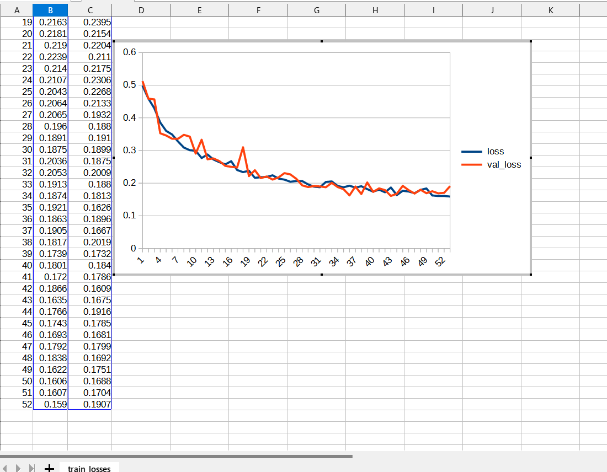 
 
The following debug setting is helpful whether your parameters in [augmentor] section are good or not.
<pre>
[generator]
debug     = True
</pre>
You can check the yielded images and mask files used in the actual train-eval process in the following folders under
<b>./projects/TensorflowSlightlyFlexibleUNet/Augmented-Pancreas/</b>.  
<pre>
generated_images_dir
generated_masks_dir
</pre>

Sample images in generated_images_dir 
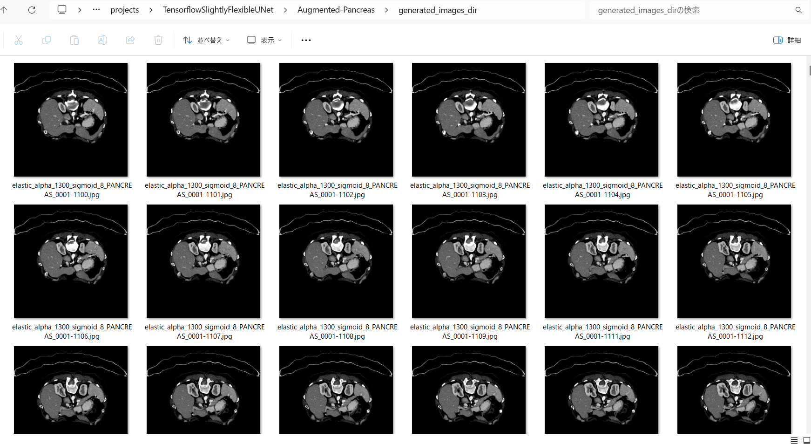 
Sample masks in generated_masks_dir 
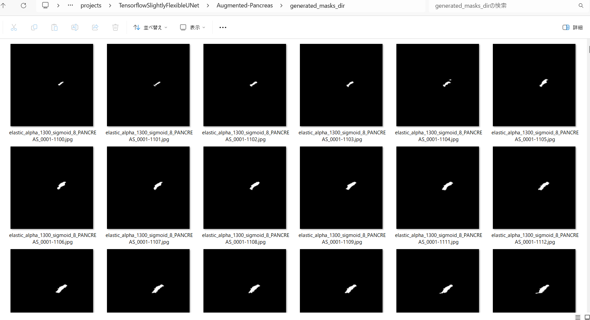 

<h3>
3.2 Evaluation
</h3>
Please move to a <b>./projects/TensorflowSlightlyFlexibleUNet/Augmented-Pancreas</b> folder, 
and run the following bat file to evaluate TensorflowUNet model for Pancreas. 
<pre>
./2.evaluate.bat
</pre>
<pre>
python ../../../src/TensorflowUNetEvaluator.py ./train_eval_infer.config
</pre>
This will evaluate segmentation accuracy of the train model by using dataset specified in [test] section. 
<pre>
[test] 
image_datapath = "../../../dataset/Cropped-Pancreas/test/images/"
mask_datapath  = "../../../dataset/Cropped-Pancreas/test/masks/"
</pre>
Evaluation console output: 
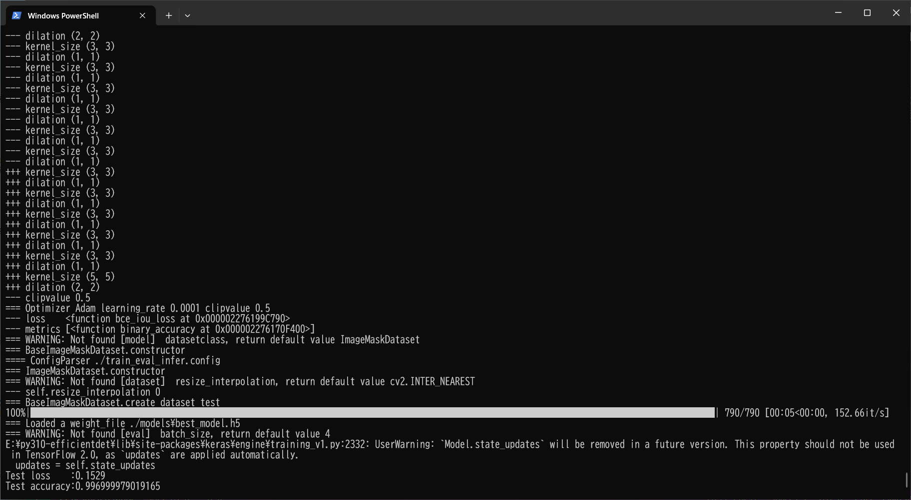 
 
Although enhanced test dataset is used here, the loss score above is slightly better than that of the first experiment
 
Evaluation console output of the first experiment: 
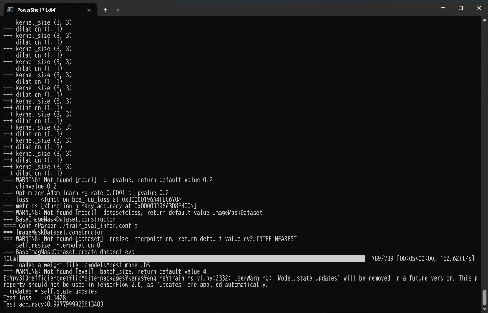 

<h2>
3.3 Inference
</h2>
Please move to a <b>./projects/TensorflowSlightlyFlexibleUNet/Pancreas</b> folder 
,and run the following bat file to infer segmentation regions for images by the Trained-TensorflowUNet model for Pancreas. 
<pre>
./3.infer.bat
</pre>
<pre>
python ../../../src/TensorflowUNetInferencer.py ./train_eval_infer.config
</pre>
Sample test images 
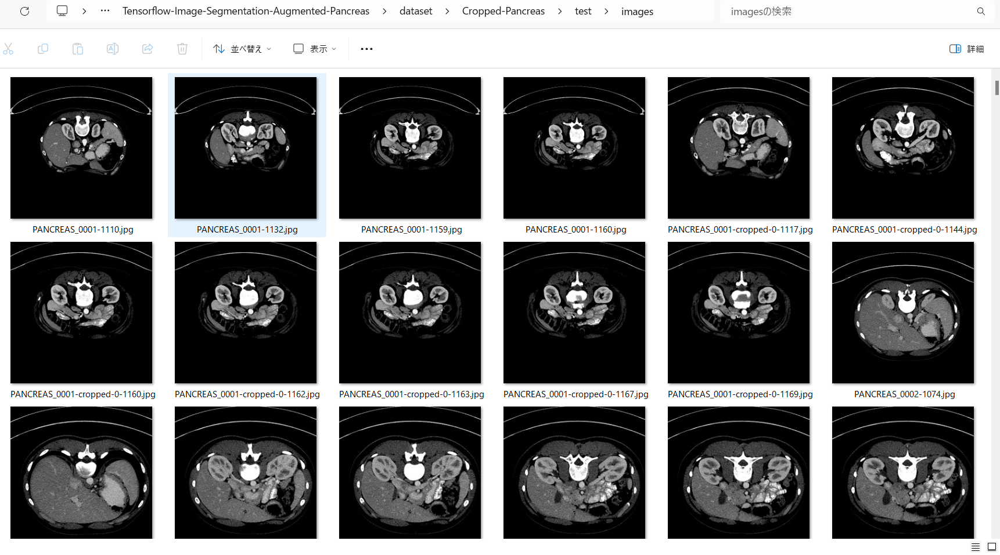 
Sample test mask (ground_truth) 
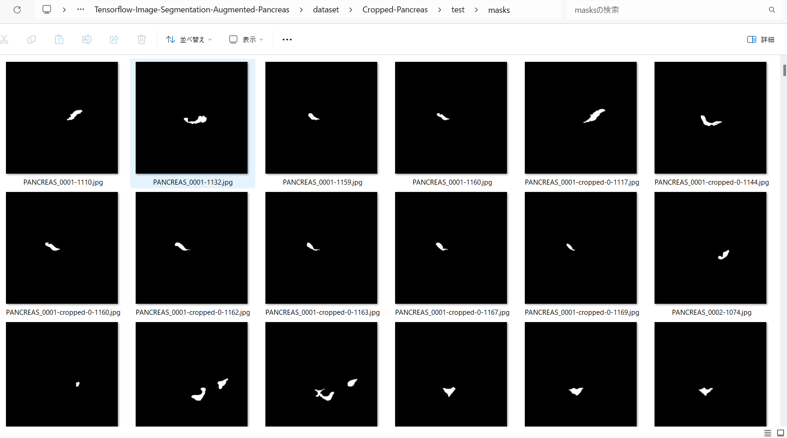 

 
Inferred test masks 
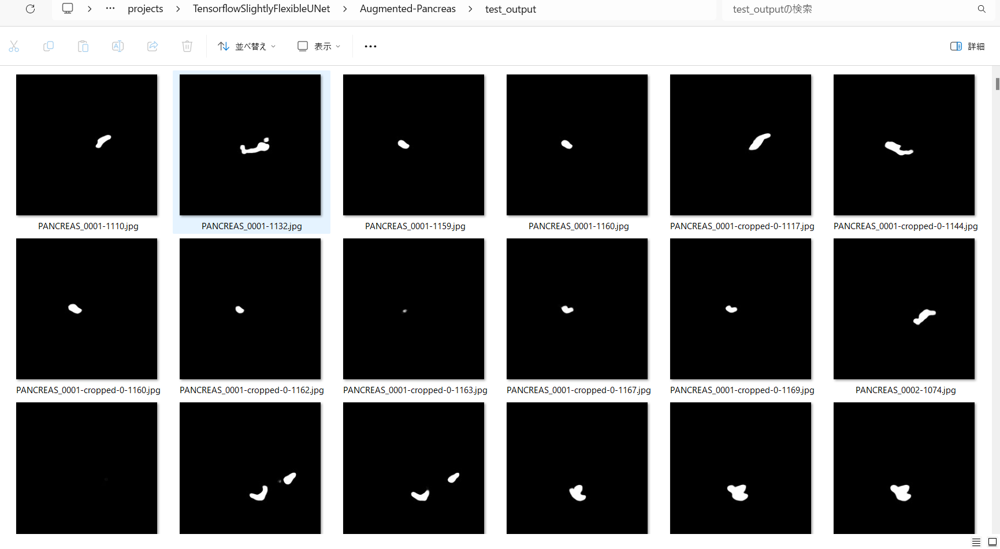 
 
The inferred masks above seem to be larger than the ground_truth masks in <b>./dataset/Cropped-Pancreas/test/masks</b> folder, 
probably this is caused by the parameter settings in [mask] section. 
You may be necessary to change the blur parameter to be False as show below. 
<pre>
[mask]
blur      = False
</pre>
 
Merged test images and inferred masks  
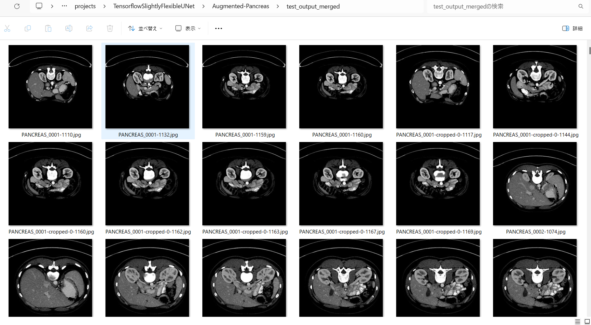  

Enlarged samples 
<table>
<tr>
<td>
test/images/PANCREAS_0001-1110.jpg 

</td>
<td>
Inferred merged/PANCREAS_0001-1110.jpg 
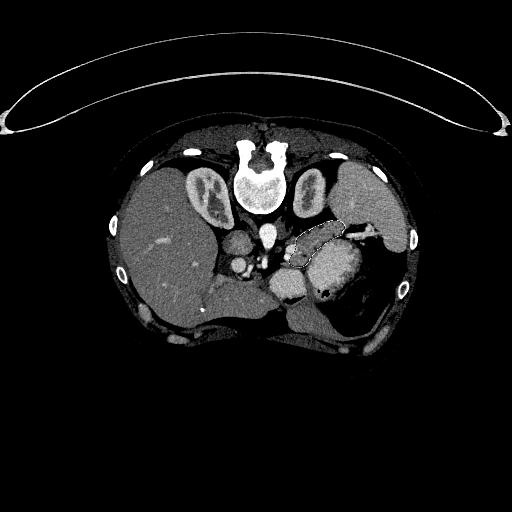
</td> 
</tr>
<tr>
<td>
test/images/PANCREAS_0001-1132.jpg 
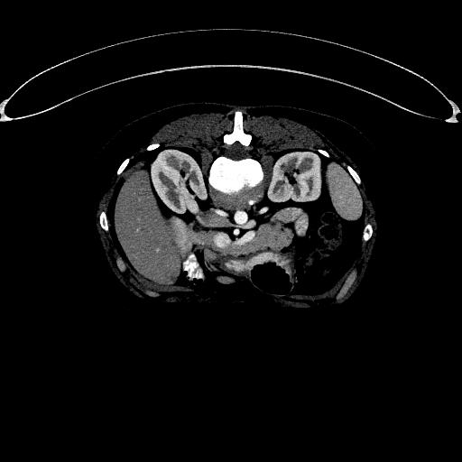
</td>
<td>
Inferred merged/PANCREAS_0001-1132.jpg 

</td> 
</tr>

<tr>
<td>
test/images/PANCREAS_0001-cropped-0-1167.jpg 

</td>
<td>
Inferred merged/PANCREAS_0001-cropped-0-1167.jpg 
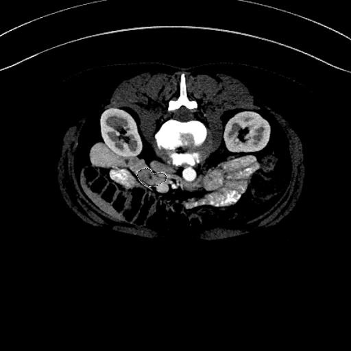
</td> 
</tr>

<tr>
<td>
test/images/PANCREAS_0002-cropped-1-1081.jpg 
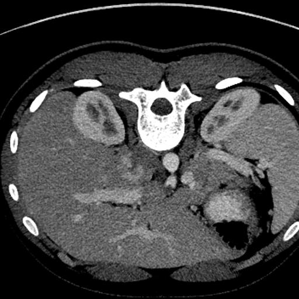
</td>
<td>
Inferred merged/PANCREAS_0002-cropped-1-1081.jpg 

</td> 
</tr>

<tr>
<td>
test/images/PANCREAS_0002-cropped-1-1096.jpg 

</td>
<td>
Inferred merged/PANCREAS_0002-cropped-1-1096.jpg 
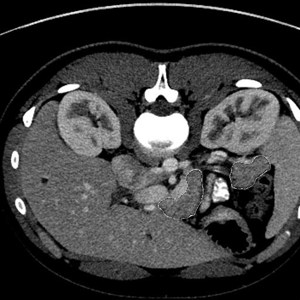
</td> 
</tr>
</table>

<h3>
References
</h3>

<b>1. Accurate pancreas segmentation using multi-level pyramidal pooling residual U-Net with adversarial mechanism</b> 
Li, M., Lian, F., Wang, C. et al.  
BMC Med Imaging 21, 168 (2021). https://doi.org/10.1186/s12880-021-00694-1 
<pre>
https://bmcmedimaging.biomedcentral.com/articles/10.1186/s12880-021-00694-1
</pre>

<b>2. Automated pancreas segmentation and volumetry using deep neural network on computed tomography</b> 
Sang-Heon Lim, Young Jae Kim, Yeon-Ho Park, Doojin Kim, Kwang Gi Kim & Doo-Ho Lee 
Sci Rep 12, 4075 (2022). https://doi.org/10.1038/s41598-022-07848-3 
<pre>
https://www.nature.com/articles/s41598-022-07848-3#Sec11
</pre>

<b>3. Pancreas-ImageMask-Dataset </b> 
Toshiyuki Arai @antillia.com 
<pre>
https://github.com/atlan-antillia/Pancreas-ImageMask-Dataset
</pre>

<b>4. Tensorflow-Image-Segmentation-Pancreas</b> 
Toshiyuki Arai @antillia.com 
<pre>
https://github.com/atlan-antillia/Tensorflow-Image-Segmentation-Pancreas
</pre>
