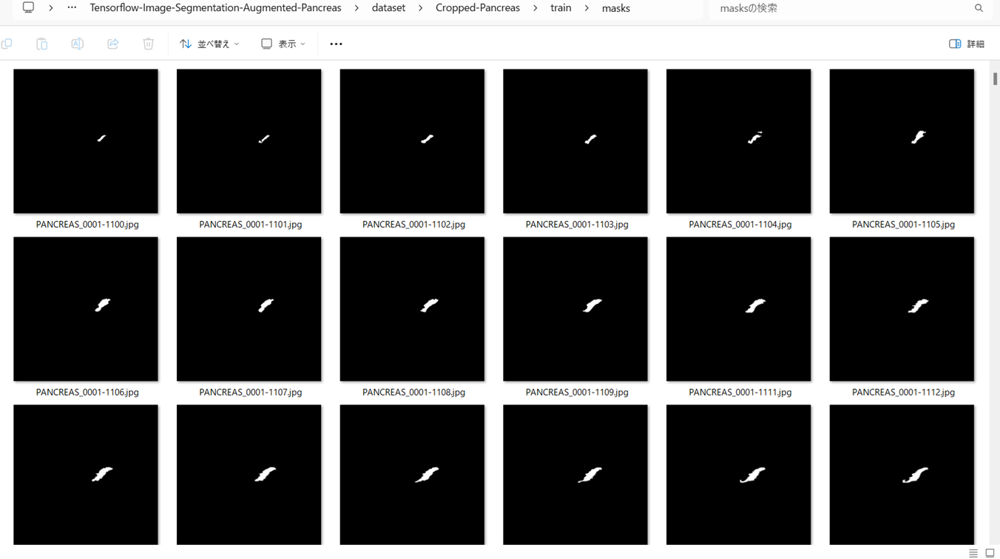
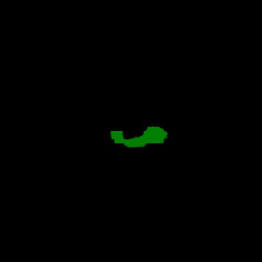

<h2>Tensorflow-Image-Segmentation-Cropped-Pancreas (Updated:2025/04/17)</h2>

Toshiyuki A. Arai 
Software Laboratory antillia.com  

<li>2025/04/17: Updated to use the latest Tensorflow-Image-Segmentation-API</li>
 

This is the second experiment of Image Segmentation for Pancreas 
 based on 
the latest <a href="https://github.com/sarah-antillia/Tensorflow-Image-Segmentation-API">Tensorflow-Image-Segmentation-API</a>, 
and <a href="https://drive.google.com/file/d/141HL4nRT8LZoqtxk2un6cM-LDuZa7jtO/view?usp=sharing">
Cropped-Pancreas-ImageMask-Dataset</a>, which was derived by us from the original dataset
<a href="https://www.kaggle.com/datasets/salihayesilyurt/pancreas-ct">
<b>Pancreas-CT</b></a>
 
 
Please see also our first experiment <a href="https://github.com/atlan-antillia/Tensorflow-Image-Segmentation-Pancreas">
Tensorflow-Image-Segmentation-Pancreas
</a>
 
 

<b>Actual Image Segmentation for Images of 512x512 pixels</b> 
As shown below, the inferred masks look similar to the ground truth masks.  

<table>
<tr>
<th>Input: image</th>
<th>Mask (ground_truth)</th>
<th>Prediction: inferred_mask</th>
</tr>
<tr>
<td></td>
<td></td>
<td></td>
</tr>

<tr>
<td></td>
<td></td>
<td></td>
</tr>

<tr>
<td></td>
<td></td>
<td></td>
</tr>
</table>

 
In this experiment, we used the simple UNet Model 
<a href="./src/TensorflowUNet.py">TensorflowSlightlyFlexibleUNet</a> for this PancreasSegmentation Model. 
As shown in <a href="https://github.com/sarah-antillia/Tensorflow-Image-Segmentation-API">Tensorflow-Image-Segmentation-API</a>.
you may try other Tensorflow UNet Models: 

<li><a href="./src/TensorflowSwinUNet.py">TensorflowSwinUNet.py</a></li>
<li><a href="./src/TensorflowMultiResUNet.py">TensorflowMultiResUNet.py</a></li>
<li><a href="./src/TensorflowAttentionUNet.py">TensorflowAttentionUNet.py</a></li>
<li><a href="./src/TensorflowEfficientUNet.py">TensorflowEfficientUNet.py</a></li>
<li><a href="./src/TensorflowUNet3Plus.py">TensorflowUNet3Plus.py</a></li>
<li><a href="./src/TensorflowDeepLabV3Plus.py">TensorflowDeepLabV3Plus.py</a></li>

 

<h3>1. Dataset Citation</h3>

The original image dataset used here has been taken from the following kaggle.com web site. 
<a href="https://www.kaggle.com/datasets/salihayesilyurt/pancreas-ct">
Pancreas-CT</a> 
Created by Sean Berryman, last modified by Tracy Nolan on Sep 16, 2020 
 
<b>About Dataset</b> 
Summary: 

The National Institutes of Health Clinical Center performed 82 abdominal contrast enhanced 3D CT  
scans (~70 seconds after intravenous contrast injection in portal-venous) from 53 male and 27  
female subjects. Seventeen of the subjects are healthy kidney donors scanned prior to nephrectomy.  
The remaining 65 PANCREAS_s were selected by a radiologist from PANCREAS_s who neither had major  
abdominal pathologies nor pancreatic cancer lesions. Subjects' ages range from 18 to 76 years with  
a mean age of 46.8 ± 16.7. The CT scans have resolutions of 512x512 pixels with varying pixel sizes  
and slice thickness between 1.5 − 2.5 mm, acquired on Philips and Siemens MDCT scanners  
(120 kVp tube voltage). 
 
A medical student manually performed slice-by-slice segmentations of the pancreas as ground-truth  
and these were verified/modified by an experienced radiologist. 

Reference: https://wiki.cancerimagingarchive.net/display/Public/Pancreas-CT 

<a href="./projects/TensorflowSlightlyFlexibleUNet/Cropped-Pancreas/LICENSE">LICENSE</a>

 
 
<h3>
<a id="2">
2 Cropped-Pancreas ImageMask Dataset
</a>
</h3>
 If you would like to train this Pancreas Segmentation model by yourself,
 please download our 512x512 pixels dataset from the google drive  
<a href="https://drive.google.com/file/d/141HL4nRT8LZoqtxk2un6cM-LDuZa7jtO/view?usp=sharing">
Cropped-Pancreas-ImageMask-Dataset</a>
</a>
, expand the downloaded ImageMaskDataset and put it under <b>./dataset</b> folder to be
<pre>
./dataset
└─Cropped-Pancreas
    ├─test
    │   ├─images
    │   └─masks
    ├─train
    │   ├─images
    │   └─masks
    └─valid
        ├─images
        └─masks
</pre>
 
On detail of this Cropped-Pancreas dataset, please refer to our repository:
<a href="https://github.com/atlan-antillia/Pancreas-ImageMask-Dataset">Pancreas-ImageMask-Dataset</a> 

As mentioned in <a href="https://github.com/atlan-antillia/Pancreas-ImageMask-Dataset">Pancreas-ImageMask-Dataset</a>, 
by applying two types of center cropping operations to the original images and masks files, the number of those files in this dataset has increased 
three-fold from the previous Non-Cropped Pancreas dataset.
However, simply increasing the number of image and mask files does not necessarily lead to direct improvement in the segmentation accuracy.
 
 
<b>Cropped-Pancreas Statistics</b> 
 
 
As shown above, the number of images of train and valid datasets is enough to use for a training set of our segmentation model.

 
 
<b>Train_images_sample</b> 

 
<b>Train_masks_sample</b> 

 

<h3>
3 Train TensorflowUNet Model
</h3>
 We trained Pancreas TensorflowUNet Model by using the following
<a href="./projects/TensorflowSlightlyFlexibleUNet/Cropped-Pancreas/train_eval_infer.config"> <b>train_eval_infer.config</b></a> file.  
Please move to ./projects/TensorflowSlightlyFlexibleUNet/Cropped-Pancreas and run the following bat file. 
<pre>
>1.train.bat
</pre>
, which simply runs the following command. 
<pre>
>python ../../../src/TensorflowUNetTrainer.py ./train_eval_infer.config
</pre>

<b>Model parameters</b> 
Defined a small <b>base_filters</b> and large <b>base_kernels</b> for the first Conv Layer of Encoder Block of 
<a href="./src/TensorflowUNet.py">TensorflowUNet.py</a> 
and a large num_layers (including a bridge between Encoder and Decoder Blocks).
<pre>
[model]

base_filters   = 16
base_kernels   = (9,9)
num_layers     = 8
dilation       = (3,3)
</pre>

<b>Learning rate</b> 
Defined a small learning rate.  
<pre>
[model]
learning_rate  = 0.00007
</pre>

<b>Online augmentation</b> 
Disabled our online augmentation tool. 
<pre>
[model]
model         = "TensorflowUNet"
generator     = False
</pre>

<b>Loss and metrics functions</b> 
Specified "bce_dice_loss" and "dice_coef". 
<pre>
[model]
loss           = "bce_dice_loss"
metrics        = ["dice_coef"]
</pre>
<b >Learning rate reducer callback</b> 
Enabled learing_rate_reducer callback, and a small reducer_patience.
<pre> 
[train]
learning_rate_reducer = True
reducer_factor     = 0.4
reducer_patience   = 4
</pre>

<b>Early stopping callback</b> 
Enabled early stopping callback with patience parameter.
<pre>
[train]
patience      = 10
</pre>

<b>Epoch change inference callbacks</b> 
Enabled epoch_change_infer callback. 
<pre>
[train]
epoch_change_infer       = True
epoch_change_infer_dir   =  "./epoch_change_infer"
epoch_changeinfer        = False
epoch_changeinfer_dir    = "./epoch_changeinfer"
num_infer_images         = 6
</pre>

By using this epoch_change_infer callback, on every epoch_change, the inference procedure can be called
 for 6 images in <b>mini_test</b> folder. This will help you confirm how the predicted mask changes 
 at each epoch during your training process.    

<b>Epoch_change_inference output at starting (1,2,3)</b> 
 
 
<b>Epoch_change_inference output at ending (98,99,100)</b> 
 
 

In this experiment, the training process was terminated at epoch 100.  
 
 

<a href="./projects/TensorflowSlightlyFlexibleUNet/Cropped-Pancreas/eval/train_metrics.csv">train_metrics.csv</a> 
 

 
<a href="./projects/TensorflowSlightlyFlexibleUNet/Cropped-Pancreas/eval/train_losses.csv">train_losses.csv</a> 
 
 

<h3>
4 Evaluation
</h3>
Please move to a <b>./projects/TensorflowSlightlyFlexibleUNet/Cropped-Pancreas</b> folder, 
and run the following bat file to evaluate TensorflowUNet model for Pancreas. 
<pre>
./2.evaluate.bat
</pre>
This bat file simply runs the following command.
<pre>
python ../../../src/TensorflowUNetEvaluator.py ./train_eval_infer_aug.config
</pre>
Evaluation console output: 

  Image-Segmentation-Pancreas

<a href="./projects/TensorflowSlightlyFlexibleUNet/Cropped-Pancreas/evaluation.csv">evaluation.csv</a> 
The loss (bce_dice_loss) to this Pancreas/test was low, but dice_coef not so high as shown below.
 
<pre>
loss,0.0875
dice_coef,0.8383
</pre>
 
<h3>5 Inference</h3>
Please move to a <b>./projects/TensorflowSlightlyFlexibleUNet/Cropped-Pancreas</b> folder 
,and run the following bat file to infer segmentation regions for images by the Trained-TensorflowUNet model for Pancreas. 
<pre>
./3.infer.bat
</pre>
This simply runs the following command.
<pre>
python ../../../src/TensorflowUNetInferencer.py ./train_eval_infer_aug.config
</pre>

<b>mini_test_images</b> 
 
<b>mini_test_mask(ground_truth)</b> 
 

<b>Inferred test masks</b> 
 

 

<b>Enlarged images and masks (512x512pixels)</b> 

<table>
<tr>
<th>Image</th>
<th>Mask (ground_truth)</th>
<th>Inferred-mask</th>
</tr>

<tr>
<td></td>
<td></td>
<td></td>
</tr>

<tr>
<td></td>
<td></td>
<td></td>
</tr>

<tr>
<td></td>
<td></td>
<td></td>
</tr>
<tr>
<td></td>
<td></td>
<td></td>
</tr>
<tr>
<td></td>
<td></td>
<td></td>
</tr>
<tr>
<td></td>
<td></td>
<td></td>
</tr>
</table>

 

<h3>
References
</h3>
<b>1. Accurate pancreas segmentation using multi-level pyramidal pooling residual U-Net with adversarial mechanism</b> 
Li, M., Lian, F., Wang, C. et al.  
BMC Med Imaging 21, 168 (2021). https://doi.org/10.1186/s12880-021-00694-1 
<pre>
https://bmcmedimaging.biomedcentral.com/articles/10.1186/s12880-021-00694-1
</pre>

<b>2. Automated pancreas segmentation and volumetry using deep neural network on computed tomography</b> 
Sang-Heon Lim, Young Jae Kim, Yeon-Ho Park, Doojin Kim, Kwang Gi Kim & Doo-Ho Lee 
Sci Rep 12, 4075 (2022). https://doi.org/10.1038/s41598-022-07848-3 
<pre>
https://www.nature.com/articles/s41598-022-07848-3#Sec11
</pre>

